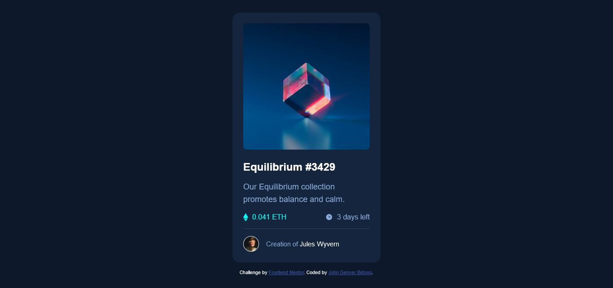
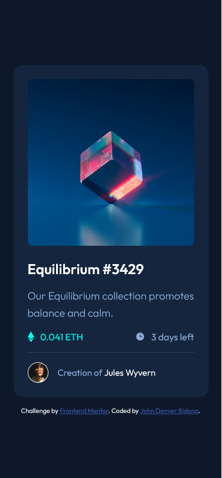

# Frontend Mentor - NFT preview card component solution

This is a solution to the [NFT preview card component challenge on Frontend Mentor](https://www.frontendmentor.io/challenges/nft-preview-card-component-SbdUL_w0U). Frontend Mentor challenges help you improve your coding skills by building realistic projects.

## Table of contents

- [Overview](#overview)
  - [The challenge](#the-challenge)
  - [Screenshot](#screenshot)
  - [Links](#links)
- [My process](#my-process)
  - [Built with](#built-with)
- [Author](#author)

## Overview

### The challenge

Users should be able to:

- View the optimal layout depending on their device's screen size
- See hover states for interactive elements

### Screenshot

**Desktop**

**Mobile**

### Links

- [Solution URL](https://www.frontendmentor.io/solutions/nft-preview-card-component-23Cs8BOxs7)
- [Live Site URL](https://jbidong.github.io/fm-preview-card-component/)

## My process

### Built with

- Semantic HTML5 markup
- SCSS
- CSS custom properties
- Flexbox
- Mobile-first workflow

## Author

- Frontend Mentor - [@Jbidong](https://www.frontendmentor.io/profile/Jbidong)
- Twitter - [@BidongJohn](https://www.twitter.com/BidongJohn)
